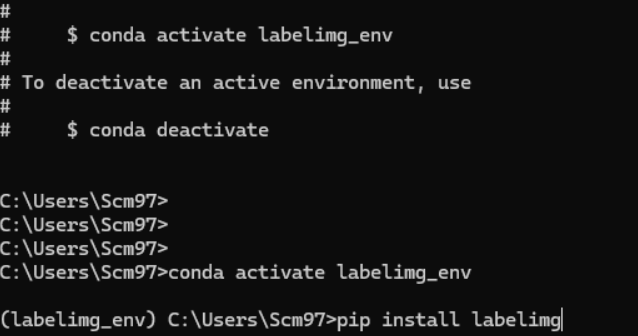
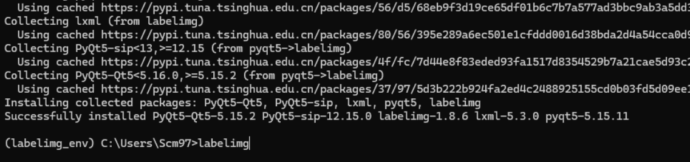
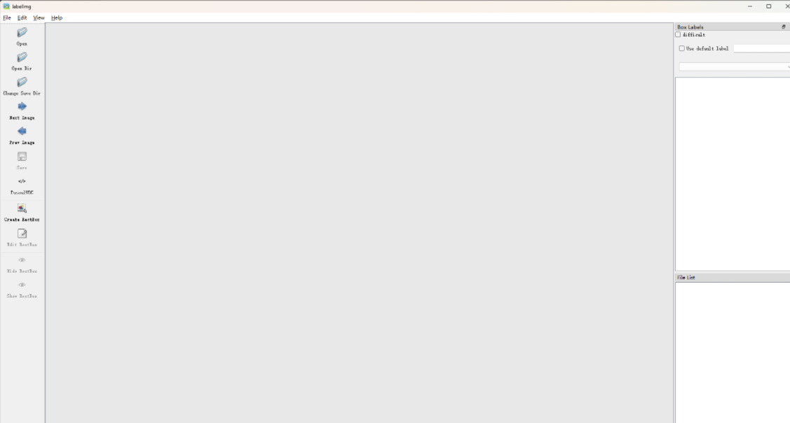
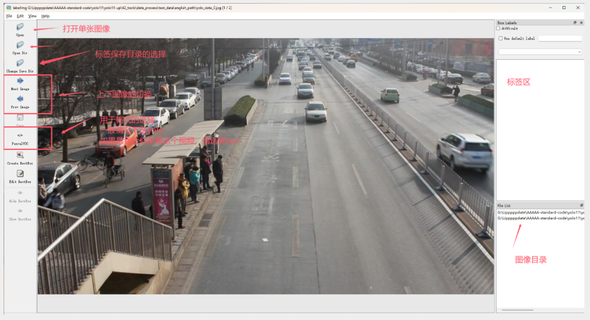

# 使用Labelimg制作自己的YOLO数据集

## 目标检测常用标注工具-LabelImg的使用

目前我们的很多教程都是围绕目标检测展开的，一般情况下我都提供了我标注好的数据集，但是有的小伙伴需要根据自己的数据集来进行标注，这个时候掌握其中一种标注工具的使用显得至关重要。其中在计算机视觉的任务中，常用的标注工具有两类，一类是labelimg，主要是用于目标检测类数据的标注，一类是labelme，常用于分割任务的标注。考虑到平时大家的任务以检测为主，所以本期我们主要讲的是标注软件labelimg的使用。

### 安装labelimg

labelimg的安装非常简单，只需要执行对应的pip指令即可。

请保证你在安装之前已经安装好了miniconda和pycharm，如果这里还没有完成，请看这期视频：[【2024毕设系列】Anaconda和Pycharm如何使用_哔哩哔哩_bilibili](https://www.bilibili.com/video/BV1A2421F7VE/?vd_source=2f9a4e63109c3db3be5e8078e5111776)

首先我们需要创建一个对应的用于这个标注功能的虚拟环境，请执行下面两个指令完成虚拟环境的创建和激活。
    
    
    conda create -n labelimg_env python==3.8.5
    conda activate labelimg_env

激活环境之后请在命令行中安装对应的labelimg软件。
    
    
    pip install labelimg

之后再命令行中输入`labelimg`即可启动标注软件，如下图所示。

#### 准备你的图像数据集

一个完整的目标检测的数据集由图像和标签构成，所以在开始之前。你需要先准备好你的图像数据集，这里的图像数据集可以是你从视频中进行截取的，或者是你从你的课题组或者是你从你的项目中获取的。总之，你会有一堆的图像放在一个文件夹下。

注意，你存放图像的路径最好只包含英文，中文可能导致后续你读取图像的时候出现乱码，为了能够让你的图像不出现乱码的问题，我这里写了一段脚本，你可以将你的图像进行事先的重命名，保证你的图像路径不会出现错误。
    
    
    # -*-coding:utf-8 -*-
    """
    #-------------------------------
    # @Author : 肆十二
    # @QQ : 3045834499 可定制毕设
    #-------------------------------
    # @File : step2_get_names.py
    # @Description: 文件描述
    # @Software : PyCharm
    # @Time : 2024/2/14 13:20
    #-------------------------------
    """
    import os
    import os.path as osp
    import numpy as np
    import cv2

​    
    def cv_imread_chinese(file_path):
        cv_img = cv2.imdecode(np.fromfile(file_path, dtype=np.uint8), cv2.IMREAD_COLOR)
        return cv_img

​    
    def folder_rename(src_folder_path, target_folder_path):
        os.makedirs(target_folder_path, exist_ok=True)
        file_names = os.listdir(src_folder_path)
        for i, file_name in enumerate(file_names):
            print("{}:{}".format(i, file_name))
            src_name= osp.join(src_folder_path, file_name)
            src_img = cv_imread_chinese(src_name)
            target_path = osp.join(target_folder_path, "yolo_data_{}.jpg".format(i))
            cv2.imwrite( target_path,src_img )
            # os.rename(src_name, target_name)
    
    if __name__ == '__main__':
        # 脚本应该生成在一个新的目录下，防止出错
        folder_rename("test_data/中文路径", "test_data/english_path")

​    

有了图像数据集之后，我们就可以开始进行标注了, 这里我放了一段黑神话悟空中的图像数据集，一会我们将会使用这个图像数据集来完成标注的任务。

### 使用labelimg

在目标检测的领域中，一般情况下你将会接触到三个格式的数据，分别是txt格式的yolo数据，xml格式的voc数据集以及json格式的coco数据，他们在目标检测数据的表示上面各有不同。一般情况下，为了训练方便，大家选择常用的coco数据，但是为了灵活性考虑的话， 可能是标注为voc格式数据更好，因为yolo格式中的数据label的id是固定的，这将会导致后面增加类别或者减少类别的时候会出现问题。下面是一个典型的标注区域，在标注之前请你先进行一下自动保存的设置，这样的话就不用反复的进行保存的确认了。

下面有一些常用的快捷键，使用这些快捷键可以帮助你快速进行标注。

快捷键| 功能  
---|---  
Ctrl + u| Load all of the images from a directory  
Ctrl + r| Change the default annotation target dir  
Ctrl + s| Save  
Ctrl + d| Copy the current label and rect box  
Ctrl + Shift + d| Delete the current image  
Space| Flag the current image as verified  
w| Create a rect box  
d| Next image  
a| Previous image  
del| Delete the selected rect box  
Ctrl++| Zoom in  
Ctrl–| Zoom out  
↑→↓←| Keyboard arrows to move selected rect box  

#### 使用yolo的格式进行标注

如果使用yolo格式进行标注，你可以提前定义好标签然后进行加载。
    
    
    python3 labelImg.py [IMAGE_PATH] [PRE-DEFINED CLASS FILE]

YOLO（You Only Look Once）是一种广泛用于目标检测的算法，YOLO的训练数据格式对于构建自定义数据集非常重要。YOLO的标签文件通常是 `.txt` 格式，并且每个图像文件都对应一个同名的标签文件。这些标签文件中存储了图像中物体的类别和位置信息。

##### YOLO数据格式说明：

  1. **图像文件** ：

    * 图像文件通常是 `.jpg`、`.png` 或其他常见的图像格式。
    * 图像的尺寸和分辨率可以根据数据集调整，但在训练前图像通常会被缩放到固定尺寸（例如 YOLOv3 的默认输入是 416x416）。
  2. **标签文件** ：

    * 标签文件是纯文本文件，扩展名为 `.txt`。
    
    * 每个图像文件有一个对应的 `.txt` 文件，文件名与图像文件名相同（但扩展名不同）。
    
    * 标签文件中每一行代表一个目标，每一行包含以下五个值：
        
                <object-class> <x_center> <y_center> <width> <height>

      * **object-class** : 物体的类别ID，从 0 开始。假设数据集中有 3 类物体，类别编号会是 0、1、2 等。
      *  **x_center** : 物体边界框中心点的 x 坐标，相对于图像的宽度进行归一化，范围为 0 到 1 之间（例如：0.5 表示在图像的正中间）。
      *  **y_center** : 物体边界框中心点的 y 坐标，相对于图像的高度进行归一化，范围为 0 到 1 之间。
      *  **width** : 边界框的宽度，相对于图像的宽度进行归一化，范围为 0 到 1 之间。
      *  **height** : 边界框的高度，相对于图像的高度进行归一化，范围为 0 到 1 之间。

##### 具体例子：

假设有一个图像文件 `dog.jpg`，其对应的标签文件 `dog.txt` 内容如下：
    
    
    0.5 0.5 0.4 0.6
    0.3 0.3 0.2 0.3

  * 第一行：物体类别为 0（假设是狗），其边界框中心位于图像的正中间 (0.5, 0.5)，宽度为图像的 40%（0.4），高度为图像的 60%（0.6）。
  * 第二行：物体类别为 1（假设是猫），其边界框中心位于 (0.3, 0.3)，宽度为图像的 20%（0.2），高度为图像的 30%（0.3）。

##### YOLO格式的注意事项：

  * 所有的坐标和尺寸都需要归一化为相对于图像宽度和高度的值。即 `(x_center, y_center, width, height)` 都是 0 到 1 之间的小数。
  * 物体类别ID是从 0 开始的整数。
  * 如果一张图片中有多个物体，标签文件中每个物体都占据一行。

##### 类别文件：

通常，YOLO会有一个额外的类别文件，通常是 `classes.names` 或 `obj.names`，该文件列出所有的类别名称，每行一个类别。例如：
    
    
    dog
    cat
    car

这个文件的顺序和标签文件中的 `object-class` 对应。

#### 使用voc的格式进行标注

Pascal VOC（Visual Object Classes）是目标检测领域非常流行的数据集格式，尤其在早期目标检测研究中被广泛使用。Pascal VOC 数据集格式与 YOLO 格式不同，VOC 使用 XML 文件来标注目标检测数据。这些 XML 文件基于 PASCAL VOC Challenge 的标准，且结构化信息较为丰富，便于扩展。

##### VOC数据格式说明

每个图像对应一个 XML 标注文件，格式为 Pascal VOC 定义的 XML 文件。文件结构描述了图像中物体的类别、位置（使用未归一化的像素坐标）、难度等信息。

###### Pascal VOC数据结构

  * **图像文件** ：

    * 图像文件通常为 `.jpg` 或 `.png` 格式，存储在 `JPEGImages` 文件夹中。
  * **标签文件** ：

    * 标签文件是 XML 格式的，通常存储在 `Annotations` 文件夹中，每个图像文件对应一个 XML 标签文件，文件名与图像名相同。

###### 主要的 XML 标签说明

下面是一个 Pascal VOC 的标签文件的例子 `2007_000027.xml`：
    
    
    <annotation>
        <folder>VOC2007</folder>
        <filename>2007_000027.jpg</filename>
        <size>
            <width>486</width>
            <height>500</height>
            <depth>3</depth>
        </size>
        <object>
            <name>dog</name>
            <pose>Left</pose>
            <truncated>1</truncated>
            <difficult>0</difficult>
            <bndbox>
                <xmin>48</xmin>
                <ymin>240</ymin>
                <xmax>195</xmax>
                <ymax>371</ymax>
            </bndbox>
        </object>
        <object>
            <name>person</name>
            <pose>Unspecified</pose>
            <truncated>0</truncated>
            <difficult>0</difficult>
            <bndbox>
                <xmin>8</xmin>
                <ymin>12</ymin>
                <xmax>352</xmax>
                <ymax>498</ymax>
            </bndbox>
        </object>
    </annotation>

##### 标签解析

  1. ****：根节点，包含所有图像和物体的信息。

  2. ****：图像所在文件夹的名称。

  3. ****：图像文件名，通常是`.jpg` 文件。

  4. ****：图像的尺寸信息：

    * ****：图像的宽度，以像素为单位。
    *  ****：图像的高度，以像素为单位。
    *  ****：图像的通道数，通常为 3（RGB 图像）。
  5. ****：每个图像中的物体对象的标签，包含多个子元素。图像中每个检测到的目标都有一个`<object>` 标签：

    * ****：物体的类别名称，例如 “dog”、“person” 等。
    *  ****：物体的姿态（选填），描述物体的方向（如 “Left”、“Right” 等）。
    *  ****：标记物体是否被截断，1 表示物体被截断，0 表示没有。被截断的物体可能只显示了一部分。
    *  ****：标记物体是否难以检测，1 表示难检测，0 表示容易检测。这个标签常用于评估算法的检测性能。
    *  ****：物体边界框（bounding box）的坐标，包含：
      *  ****：边界框左上角的 x 坐标。
      *  ****：边界框左上角的 y 坐标。
      *  ****：边界框右下角的 x 坐标。
      *  ****：边界框右下角的 y 坐标。
      * 坐标是以像素为单位的 **绝对值** ，而不是像 YOLO 中归一化到 0 和 1 的坐标。

##### Pascal VOC文件结构

一个典型的 VOC 数据集的文件结构如下：
    
    
    VOCdevkit/
    └── VOC2007/
        ├── Annotations/        # 存储 XML 格式的标签文件
        ├── ImageSets/          # 包含训练、测试集划分信息的文件夹
        │   └── Main/           # 包含 train.txt, val.txt, test.txt 等
        ├── JPEGImages/         # 存储所有的图像文件
        ├── SegmentationClass/  # 存储语义分割的标签文件（可选）
        └── SegmentationObject/ # 存储对象级分割的标签文件（可选）

  1. **Annotations** ：存储每张图像的标注文件，格式为 XML。
  2.  **ImageSets/Main** ：存储数据集划分的文件（如 train.txt, val.txt, test.txt），每个文件包含用于训练、验证、测试的图像文件名（不含扩展名）。
  3.  **JPEGImages** ：存储所有的图像文件。
  4.  **SegmentationClass** 和 **SegmentationObject** ：用于语义分割任务的标注（可选）。

##### Pascal VOC标签文件的注意事项

  * 每个 `<object>` 标签描述图像中的一个目标对象，因此如果图像中有多个目标，则 XML 文件中会有多个 `<object>` 标签。
  * 标注的坐标为像素级别，通常不需要归一化。
  * `truncated` 和 `difficult` 标签用于更细致地描述目标对象，尤其是在评估模型时，`difficult` 标签的目标可以选择忽略。

##### 如何将Pascal VOC格式转换为其他格式（如YOLO）：

如果需要将 Pascal VOC 格式转换为 YOLO 格式，可以将每个目标的 `(xmin, ymin, xmax, ymax)` 坐标转换为 YOLO 格式中的 `(x_center, y_center, width, height)`，并进行归一化操作。具体步骤如下：

  1. 计算边界框的中心点：

    * `x_center = (xmin + xmax) / 2`
    * `y_center = (ymin + ymax) / 2`
  2. 计算边界框的宽度和高度：

    * `width = xmax - xmin`
    * `height = ymax - ymin`
  3. 将中心点坐标、宽度和高度归一化为相对于图像宽度和高度的值。

如果您需要具体的代码示例来实现这个转换，我也可以为您提供。

#### 使用coco的格式进行标注

COCO（Common Objects in Context）是计算机视觉领域最广泛使用的目标检测数据集之一。COCO 数据集采用 JSON 文件格式来存储目标检测、分割、关键点检测等标注信息。由于 COCO 数据集信息非常丰富，其标注文件也相对复杂，尤其相比于 YOLO 和 Pascal VOC 格式。

##### COCO 数据集格式概述

COCO 数据集的标注文件是 JSON 格式，包含了大量关于图像、类别、目标检测框、分割、关键点等的详细信息。COCO 目标检测数据的标注文件通常会包括以下几个关键部分：

  * **info** ：关于数据集的描述信息（版本、日期、贡献者等）。
  *  **images** ：图像的基本信息，包括图像的文件名、宽度、高度、唯一 ID 等。
  *  **annotations** ：目标的标注信息，包含类别、边界框、分割区域、目标 ID 等。
  *  **categories** ：类别信息，定义了所有的目标类别及其对应的 ID。

##### 1\. JSON文件结构

典型的 COCO 目标检测标注文件结构如下：
    
    
    {
      "info": {...},           # 数据集的基本信息
      "licenses": [...],       # 图像的授权信息
      "images": [...],         # 图像的信息
      "annotations": [...],    # 每个目标的标注信息
      "categories": [...]      # 类别信息
    }

##### 2\. 主要字段说明

###### 2.1 `images`：图像信息

`images` 列表存储了每个图像的基本信息。每个图像有如下字段：
    
    
    "images": [
        {
            "id": 397133,
            "width": 640,
            "height": 480,
            "file_name": "000000397133.jpg"
        },
        ...
    ]

  * `id`：图像的唯一标识符，其他部分如 `annotations` 将使用这个 ID 引用对应的图像。
  * `width`：图像的宽度（以像素为单位）。
  * `height`：图像的高度（以像素为单位）。
  * `file_name`：图像的文件名。

###### 2.2 `annotations`：标注信息

`annotations` 列表存储了每个目标的标注信息，包括目标的边界框、类别、分割掩码等。一个典型的 `annotation` 如下：
    
    
    "annotations": [
        {
            "id": 1,
            "image_id": 397133,
            "category_id": 18,
            "bbox": [73.77, 150.54, 227.85, 304.35],
            "area": 69321.27,
            "segmentation": [[192.81, 247.09, 225.11, 249.06, ...]],
            "iscrowd": 0
        },
        ...
    ]

  * `id`：标注的唯一 ID。
  * `image_id`：对应的图像 ID，用于将标注与图像对应。
  * `category_id`：类别的 ID，表示这个目标的类别，参考 `categories` 部分。
  * `bbox`：目标的边界框（bounding box），格式为 `[x, y, width, height]`，这里的 `x` 和 `y` 是边界框左上角的坐标，`width` 和 `height` 是边界框的宽度和高度（以像素为单位）。
  * `area`：边界框的面积（`bbox` 的面积），用于评估模型的检测效果。
  * `segmentation`：多边形格式的分割掩码，用于语义分割任务。每个目标可以有一个或多个分割掩码。
  * `iscrowd`：表示目标是否是密集的、难以区分的对象。如果 `iscrowd = 1`，则意味着目标是一群密集的物体（如一群人、多个物体），否则为 0。

###### 2.3 `categories`：类别信息

`categories` 列表存储了所有目标类别的信息。每个类别的结构如下：
    
    
    "categories": [
        {
            "id": 18,
            "name": "dog",
            "supercategory": "animal"
        },
        ...
    ]

  * `id`：类别的唯一标识符，`annotations` 部分的 `category_id` 会引用这个 ID。
  * `name`：类别的名称，比如 “dog”、“person” 等。
  * `supercategory`：该类别所属的更高层级的类别分类（可选），比如 “animal”。

##### 3\. 边界框（`bbox`）格式说明

COCO 数据集中，边界框的格式为 `[x, y, width, height]`，其中：

  * `x` 和 `y` 是边界框左上角的坐标，表示该框在图像中的位置。
  * `width` 是边界框的宽度。
  * `height` 是边界框的高度。

与 YOLO 和 Pascal VOC 不同，COCO 中的边界框是 **绝对坐标** ，不需要归一化到 0 和 1 之间，而是直接使用像素值。

##### 4\. 完整COCO文件示例

以下是一个完整的 COCO 标注文件的简化示例（JSON 格式）：
    
    
    {
      "info": {
        "year": 2024,
        "version": "1.0",
        "description": "COCO-style dataset",
        "date_created": "2024-10-23"
      },
      "licenses": [
        {
          "id": 1,
          "name": "Creative Commons Attribution 4.0 License"
        }
      ],
      "images": [
        {
          "id": 1,
          "width": 640,
          "height": 480,
          "file_name": "000000000001.jpg"
        }
      ],
      "annotations": [
        {
          "id": 1,
          "image_id": 1,
          "category_id": 18,
          "bbox": [73.77, 150.54, 227.85, 304.35],
          "area": 69321.27,
          "segmentation": [[192.81, 247.09, 225.11, 249.06, ...]],
          "iscrowd": 0
        }
      ],
      "categories": [
        {
          "id": 18,
          "name": "dog",
          "supercategory": "animal"
        }
      ]
    }

##### COCO文件结构

COCO 数据集的典型文件结构如下：
    
    
    coco/
    ├── annotations/        # 存放标注的 JSON 文件
    │   ├── instances_train2017.json  # 目标检测任务的标注（训练集）
    │   ├── instances_val2017.json    # 目标检测任务的标注（验证集）
    ├── images/             # 图像数据存放位置
    │   ├── train2017/              # 训练集图像
    │   └── val2017/                # 验证集图像
    └── ...

##### 如何将COCO格式转换为其他格式（如YOLO）：

  1. **从COCO的`bbox`字段提取**：

    * 从 `bbox` 中提取左上角坐标 `(x, y)`，宽度 `width` 和高度 `height`。
    * 计算 YOLO 所需的中心点坐标和相对宽度、高度。
    * 将坐标归一化到 0 到 1 之间。
  2. **类别映射** ：

    * 根据 `category_id`，将 COCO 中的类别映射到 YOLO 类别 ID。

#### 格式之间的相互转换

当然，有的时候大家获得数据可能是别人以及标注好的，可能是voc的格式或者是json的格式，但是你可能只是想在yolo上进行训练，所以在这里，我提供两段脚本，分别用于voc格式向yolo格式数据的转化和coco数据向yolo格式数据的转化。

  * voc格式数据转化为yolo格式数据
    
        import os
    import xml.etree.ElementTree as ET
    
    # VOC格式的目标类别列表（根据实际数据集的类别名称修改）
    # 这是一份VOC数据集的类别示例，您可以根据实际类别修改
    classes = ["aeroplane", "bicycle", "bird", "boat", "bottle", 
               "bus", "car", "cat", "chair", "cow", "diningtable", 
               "dog", "horse", "motorbike", "person", "pottedplant", 
               "sheep", "sofa", "train", "tvmonitor"]
    
    # 读取XML文件，转换为YOLO格式
    def convert_voc_to_yolo(xml_file, output_dir, img_width, img_height):
        tree = ET.parse(xml_file)
        root = tree.getroot()
        
        # 获取图像文件名
        image_id = os.path.splitext(os.path.basename(xml_file))[0]
        txt_file_path = os.path.join(output_dir, f"{image_id}.txt")
        
        with open(txt_file_path, 'w') as txt_file:
            for obj in root.findall('object'):
                # 获取类别
                class_name = obj.find('name').text
                if class_name not in classes:
                    continue  # 如果类别不在我们定义的类表中，跳过
                
                class_id = classes.index(class_name)
                
                # 获取边界框信息
                xml_bbox = obj.find('bndbox')
                xmin = int(xml_bbox.find('xmin').text)
                ymin = int(xml_bbox.find('ymin').text)
                xmax = int(xml_bbox.find('xmax').text)
                ymax = int(xml_bbox.find('ymax').text)
                
                # 计算YOLO格式的 (x_center, y_center, width, height)，并归一化
                x_center = (xmin + xmax) / 2.0 / img_width
                y_center = (ymin + ymax) / 2.0 / img_height
                width = (xmax - xmin) / img_width
                height = (ymax - ymin) / img_height
                
                # 写入到YOLO格式的txt文件中
                txt_file.write(f"{class_id} {x_center:.6f} {y_center:.6f} {width:.6f} {height:.6f}\n")
        
        print(f"Converted {xml_file} to {txt_file_path}")
    
    # 批量转换函数
    def convert_all_voc_to_yolo(voc_annotations_dir, output_dir, img_width, img_height):
        if not os.path.exists(output_dir):
            os.makedirs(output_dir)
        
        xml_files = [f for f in os.listdir(voc_annotations_dir) if f.endswith('.xml')]
        
        for xml_file in xml_files:
            convert_voc_to_yolo(os.path.join(voc_annotations_dir, xml_file), output_dir, img_width, img_height)
    
    # 使用示例：定义VOC格式的注释目录、输出目录、图像尺寸
    voc_annotations_dir = './VOCdevkit/VOC2007/Annotations'
    output_dir = './VOCdevkit/VOC2007/YOLO_labels'
    img_width = 640  # 替换为图像的实际宽度
    img_height = 480  # 替换为图像的实际高度
    
    convert_all_voc_to_yolo(voc_annotations_dir, output_dir, img_width, img_height)
    
    

##### 主要步骤说明：

    1. **类别映射 (`classes`)**：在脚本中，`classes` 列表存储了您目标检测任务中的类别。请确保 VOC 数据集中的类别与 YOLO 使用的类别相匹配，并且 `classes` 列表中的顺序与您希望的类别顺序一致。
    2.  **XML 解析** ：脚本使用 Python 的 `xml.etree.ElementTree` 模块来解析 Pascal VOC 的 XML 标注文件，并提取目标的类别和边界框坐标。
    3.  **YOLO 格式转换** ：对于每个边界框，脚本将 `(xmin, ymin, xmax, ymax)` 转换为 YOLO 所需的 `(x_center, y_center, width, height)` 格式，并将其归一化（相对于图像的宽度和高度）。
    4.  **输出 YOLO 文件** ：每个图像生成一个 `.txt` 文件，文件名与图像名相同。每个 `.txt` 文件的每一行对应一个目标，包含目标类别的 ID 和归一化后的边界框信息。
    5.  **批量处理** ：`convert_all_voc_to_yolo` 函数可以批量转换整个目录中的 XML 文件。

###### 如何将COCO格式转换为其他格式（如YOLO）：

    1. 从COCO的`bbox`字段提取： 
      * 从 `bbox` 中提取左上角坐标 `(x, y)`，宽度 `width` 和高度 `height`。
      * 计算 YOLO 所需的中心点坐标和相对宽度、高度。
      * 将坐标归一化到 0 到 1 之间。
    2. 类别映射： 
      * 根据 `category_id`，将 COCO 中的类别映射到 YOLO 类别 ID。
  * coco格式数据转换为yolo格式数据
    
        import json
    import os
    
    # COCO格式的类别信息，按顺序填入类别名称
    # 这里是一个简单示例，COCO标准数据集可能包含80个类别，您可根据需要调整
    coco_classes = [
        'person', 'bicycle', 'car', 'motorcycle', 'airplane', 'bus', 'train', 'truck', 'boat', 
        'traffic light', 'fire hydrant', 'stop sign', 'parking meter', 'bench', 'bird', 'cat', 
        'dog', 'horse', 'sheep', 'cow', 'elephant', 'bear', 'zebra', 'giraffe', 'backpack', 
        'umbrella', 'handbag', 'tie', 'suitcase', 'frisbee', 'skis', 'snowboard', 'sports ball', 
        'kite', 'baseball bat', 'baseball glove', 'skateboard', 'surfboard', 'tennis racket', 
        'bottle', 'wine glass', 'cup', 'fork', 'knife', 'spoon', 'bowl', 'banana', 'apple', 
        'sandwich', 'orange', 'broccoli', 'carrot', 'hot dog', 'pizza', 'donut', 'cake', 
        'chair', 'couch', 'potted plant', 'bed', 'dining table', 'toilet', 'tv', 'laptop', 
        'mouse', 'remote', 'keyboard', 'cell phone', 'microwave', 'oven', 'toaster', 'sink', 
        'refrigerator', 'book', 'clock', 'vase', 'scissors', 'teddy bear', 'hair drier', 
        'toothbrush'
    ]
    
    # 加载COCO的JSON文件
    def load_coco_annotations(json_file):
        with open(json_file, 'r') as f:
            data = json.load(f)
        return data
    
    # 将COCO的bbox转换为YOLO格式
    def convert_coco_to_yolo(image_id, annotations, img_width, img_height, output_dir):
        txt_file_path = os.path.join(output_dir, f"{image_id}.txt")
        
        with open(txt_file_path, 'w') as txt_file:
            for ann in annotations:
                if ann['image_id'] != image_id:
                    continue
                
                # 获取类别ID，COCO的category_id需要映射到YOLO的class id
                category_id = ann['category_id'] - 1  # 假设类别从1开始编号，需要减1
                
                # 获取COCO的bbox (x, y, width, height)
                bbox = ann['bbox']
                x, y, width, height = bbox
                
                # 计算YOLO的x_center, y_center并归一化
                x_center = (x + width / 2.0) / img_width
                y_center = (y + height / 2.0) / img_height
                norm_width = width / img_width
                norm_height = height / img_height
                
                # 写入YOLO格式的txt文件中
                txt_file.write(f"{category_id} {x_center:.6f} {y_center:.6f} {norm_width:.6f} {norm_height:.6f}\n")
        
        print(f"Converted annotations for image {image_id} to {txt_file_path}")
    
    # 批量处理COCO的图像和标注信息
    def convert_all_coco_to_yolo(coco_json_file, output_dir):
        data = load_coco_annotations(coco_json_file)
        
        # 获取图像信息和标注信息
        images = data['images']
        annotations = data['annotations']
        
        # 创建输出目录
        if not os.path.exists(output_dir):
            os.makedirs(output_dir)
        
        # 遍历所有图像
        for image in images:
            image_id = image['id']
            img_width = image['width']
            img_height = image['height']
            
            # 转换每个图像的标注
            convert_coco_to_yolo(image_id, annotations, img_width, img_height, output_dir)
    
    # 使用示例：定义COCO的JSON文件、输出目录
    coco_json_file = './coco/annotations/instances_train2017.json'  # 替换为COCO的JSON文件路径
    output_dir = './coco/YOLO_labels'  # 输出目录
    
    # 执行转换
    convert_all_coco_to_yolo(coco_json_file, output_dir)
    
    

##### 代码详细说明：

    1. **类别映射 (`coco_classes`)**：该列表包含 COCO 数据集中所有类别的名称。假设类别编号从 1 开始，因此类别 ID 减 1 转换为 0 开始的编号，这与 YOLO 的类别 ID 对应。
    
    2. **加载 COCO 标注文件** ：函数 `load_coco_annotations` 用于加载 COCO 格式的 JSON 文件，该文件包含了图像、类别、边界框、分割等信息。
    
    3. **COCO 到 YOLO 的边界框转换** ：函数 `convert_coco_to_yolo` 负责将每个目标的 COCO 格式边界框 `[x, y, width, height]` 转换为 YOLO 所需的 `(x_center, y_center, width, height)`，并将其归一化为相对于图像宽度和高度的值。
    
    4. **输出 YOLO 格式** ：转换后的数据将保存为 `.txt` 文件，文件名与图像名相同。每行表示一个物体，内容为：
        
                php

​        
        Copy code
        <class_id> <x_center> <y_center> <width> <height>

    5. **批量处理** ：函数 `convert_all_coco_to_yolo` 遍历所有图像，并为每个图像生成一个对应的 `.txt` 文件。

##### 使用说明：

    * **COCO 标注文件路径** ：修改 `coco_json_file` 为 COCO 数据集中 JSON 标注文件的路径（例如 `instances_train2017.json`）。
    *  **输出目录** ：修改 `output_dir` 为保存 YOLO 格式的标签文件的目录。

运行脚本后，YOLO 格式的标签文件将被保存在指定的输出目录中，每个图像有一个 `.txt` 文件。

### 注意事项

上面叙述了很多内容，但是主要我想表达的还是如果你需要进行高质量的标注，熟悉这些数据格式将是非常重要的，熟悉数据的格式也可以帮助你更加了解你的任务。

  1. 尽量只用数字、英文以及下划线来进行表示。
  2. yolo模式下最好一次性标注完成。
  3. 学会快捷方式的使用将会让你事半功倍。

